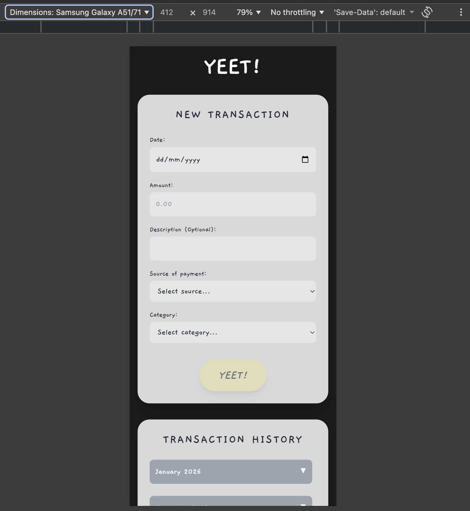
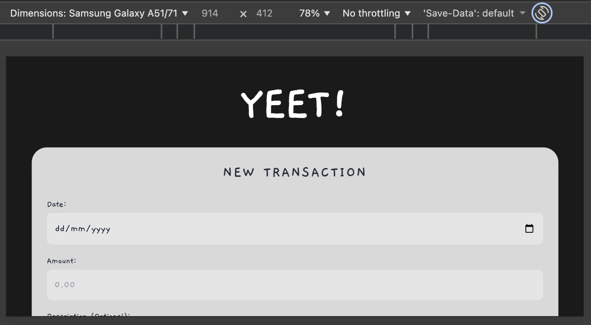
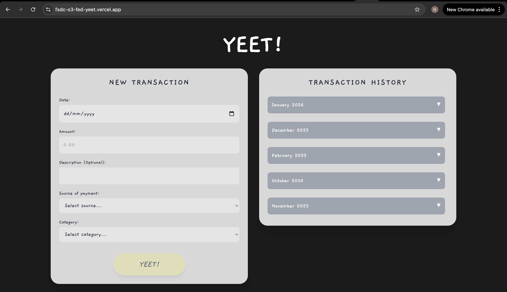

# Yeet - Spending Tracker

Yeet tracks your expenditure and neatly compiles your inputs into a csv for your own further analysis when needed.
Taking expenditure tracking off your mind is just a stone's throw away - Yeet!

## Links

-   [GitHub Page](https://github.com/Niclokt/fsdc-s3-fed-yeet.git)
-   [Live Link](https://fsdc-s3-fed-yeet.vercel.app/)

## Design Process

#### User Stories

-   As a lazy and impatient tracker, I want to be able to easily input my expenditure, to track my expenditure
-   As someone who prefers the flexibility of analysing data, I want to store my expenditure records in csv format, so that it is portable and highly compatible with popular open-source analytical tools.

#### Wireframe

-   [Figma](https://www.figma.com/design/wCQPRsDgpCs8RiP1cPr8KZ/NP_S3_FED_Yeet?node-id=0-1&t=KrKzJTZxmlnLMUsX-1)

## Features

In this section, you should go over the different parts of your project, and describe each in a sentence or so.

### Existing Features

-   **New Transaction Entry** – allows users to log expenditure by having them fill out the Date, Amount, Description, Source of payment, and Category via an input form.

-   **Real-time Form Validation** – allows users to ensure data completeness by having the application monitor all required fields and only enable the submission button once the form is valid.

-   **Automated Cloud Sync** – allows users to store their data permanently by having submitting the form, which triggers an asynchronous POST request to a Google Apps Script (Google Sheets) backend.

-   **Dynamic History Retrieval** – allows users to view their previous expenditure records by having the application fetch data from the Google Sheets API automatically whenever the page loads or a new entry is added.

-   **Collapsible Chronological Groups** – allows users to organize and navigate large amounts of data by having the application auto-sort transactions by month and year into expandable `<details>` sections.

-   **Visual Spending Summaries** – allows users to quickly scan individual costs by having them view transaction cards that display the amount in a large, bold font alongside the payment source and category.

-   **Custom Responsive Interface** – allows users to track transactions on any device by having the application utilize Tailwind CSS to adjust the layout from a single column on mobile to a side-by-side view on desktop.

<br>

### Features Left to Implement

-   **Total Expenditure Calculation** – allows users to see their total expendture at a glance by having the application sum up all amounts in the fetched transaction list and display it at the top of the history section.

-   **Transaction Deletion** – allows users to remove mistakes by having them click a "Delete" button on a transaction card, which sends a request to the Google Sheets API to remove that specific row.

-   **Data Filtering and Search** – allows users to find specific expenses by having them type into a search bar or select a category filter to hide transactions that don't match.

-   **Category-Based Analytics** – allows users to visualize their habits by having the application generate a pie chart (using a library like Chart.js) showing the percentage of spending on "Food" vs. "Bills."

-   **Edit Existing Transactions** – allows users to fix typos by having them click an "Edit" icon that populates the "New Transaction" form with the existing data for modification.

-   **User Authentication** – allows multiple users to have private sheets by having them log in ensuring that one person's transaction history isn't visible to everyone else using the app.

-   **Personalised Spending Recommendations** - LLM takes into account user's priorities, then analyses and suggests how spending could be better allocated.

## Technologies Used

In this section, you should mention all of the languages, frameworks, libraries, and any other tools that you have used to construct this project. For each, provide its name, a link to its official site and a short sentence of why it was used.

-   [Vercel](https://vercel.com/)

    -   The project utilizes Vercel as the cloud hosting platform to deploy the frontend user interface and host the Node.js serverless functions that act as a secure API bridge between the application and Google Workspace.

-   [Node JS](https://nodejs.org/en)

    -   The project utilizes Node.js as a serverless backend runtime to act as a secure intermediary between the client-side interface and the Google Sheets API. It manages API routing, handles environment variables to protect sensitive credentials, and ensures reliable server-to-server communication by bypassing browser-based CORS restrictions.

-   [Tailwind CSS](https://tailwindcss.com/)
    -   The project uses Tailwind CSS to rapidly style the user interface using utility-first classes directly within the HTML.
-   [Google Apps Script](https://developers.google.com/apps-script)
    -   The project uses Google Apps Script as the backend server-side logic to process incoming transaction data and interface directly with Google workspace.
-   [Google Sheets API](https://developers.google.com/workspace/sheets/api/reference/rest)

    -   The project uses the Google Sheets API (via the Apps Script execution API) to read, write, and organize transaction records within a spreadsheet as a database.

## Testing

#### Test Cases

`For any scenarios that have not been automated, test the user stories manually and provide as much detail as is relevant. A particularly useful form for describing your testing process is via scenarios, such as:`

```
1. Contact form:

    1. Go to the "Contact Us" page
    2. Try to submit the empty form and verify that an error message about the required fields appears
    3. Try to submit the form with an invalid email address and verify that a relevant error message appears
    4. Try to submit the form with all inputs valid and verify that a success message appears.
```

1. Input form:

    1. Populate all 5 fields
    2. Submit form
    3. Go to google sheets, verify that all 5 columns are populated
    4. Verify that values from the input fields are mapped and saved to the right column in Google sheets

2. Collapsible Chronological Group

    1. Open the application URL in a web browser.
    2. Observe the Transaction History section after the "Loading" message disappears.
    3. Verify the sorting order of the groups and the items within them.
    4. Click on the Month/Year header (the <summary> element).
    5. Add a new transaction via the "NEW TRANSACTION" form for a month that does not yet exist in the history.

3. Edit Transaction Record:
    1. Go to the "Transaction History" section
    2. Swipe left on one of the transaction records, to reveal edit and delete buttons
    3. Click on the edit button
    4. Edit the Description field
    5. Click on "Update Yeet" button
    6. Go to google sheets to check if edits to the corresponding transaction records have been saved.

#### Responsiveness

1. On a small/ mobile screen, cards are stacked into a single column

    - Vertical:
      
    - Horizontal
      

2. On a large / desktop screen, cards are arranged side-by-side
    - Desktop
      

#### API testing

-   [Swagger](https://fsdc-s3-fed-yeet.vercel.app/docs.html)
    1. GET Method
        - Test if calling it retrieves the existing transaction records from Google Sheets
    2. POST Method (Create)
        - Test if properties of the JSON object payload is correct
        - Send payload where id= null
        - Test if a new row is created in Google Sheets
    3. POST Method (Edit)
        - Test if properties of the JSON object payload is correct
        - Send a payload where id corresponds to 1 of the id in the list of transaction records
        - Test if a new row is created in Google Sheets

## Credits

### Content

-   NA

### Media

-   NA

### Acknowledgements

-   I received inspiration for this project from UOB and HSBC's banking applications
